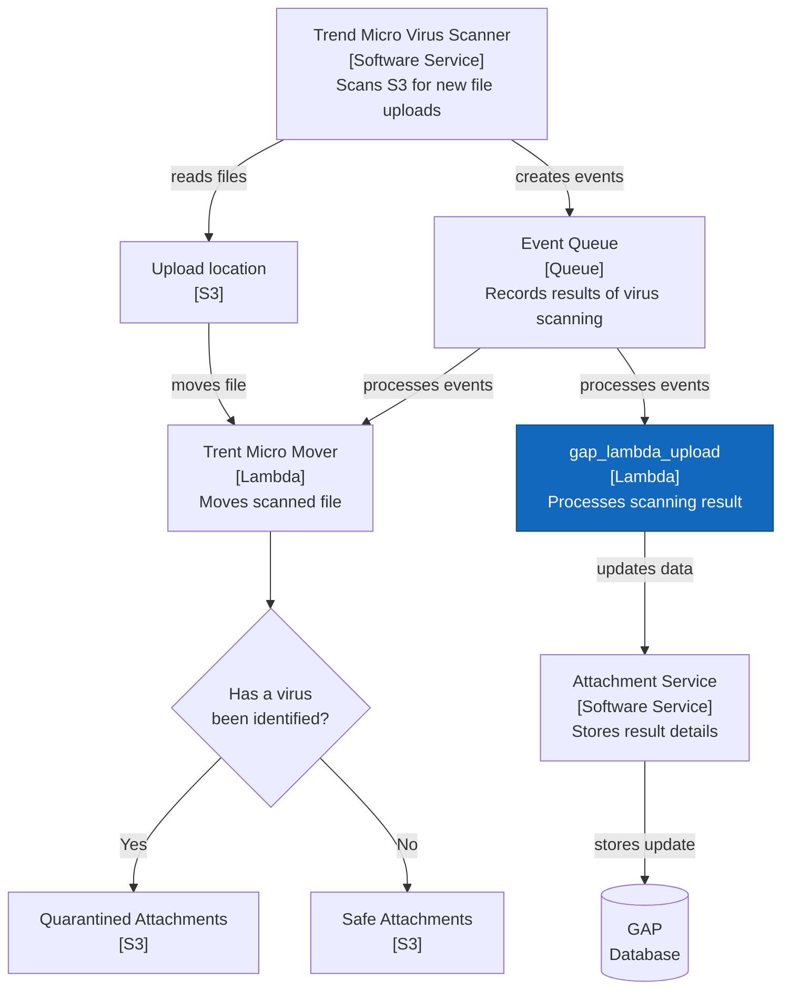

# gap-lambda-upload

This project contains source code and supporting files for the GAP upload lambda function.

Directories
- upload_function - Code for the application's Lambda function and Project Dockerfile.
- events - Invocation events that you can use to invoke the function.
- tests - Unit tests for the application code. 
- template.yaml - A template that defines the application's AWS resources.

## Overview
The lambda is part of our virus scanning support for uploaded files. It is triggered by an entry in the SNS created by Trend Micro virus scanning - events being created after a scan has been performed.



## Deploy the sample application

The Serverless Application Model Command Line Interface (SAM CLI) is an extension of the AWS CLI that adds functionality for building and testing Lambda applications. It uses Docker to run your functions in an Amazon Linux environment that matches Lambda. It can also emulate your application's build environment and API.

To build the lambda:
```bash
sam build
```
This will build a docker image from a Dockerfile and then copy the source of your application inside the Docker image.


To deploy the lambda:
```bash
sam deploy --guided
```
This will package and deploy your application to AWS, with a series of prompts:

* **Stack Name**: The name of the stack to deploy to CloudFormation. This should be unique to your account and region, and a good starting point would be something matching your project name.
* **AWS Region**: The AWS region you want to deploy your app to.
* **Confirm changes before deploy**: If set to yes, any change sets will be shown to you before execution for manual review. If set to no, the AWS SAM CLI will automatically deploy application changes.
* **Allow SAM CLI IAM role creation**: Many AWS SAM templates, including this example, create AWS IAM roles required for the AWS Lambda function(s) included to access AWS services. By default, these are scoped down to minimum required permissions. To deploy an AWS CloudFormation stack which creates or modifies IAM roles, the `CAPABILITY_IAM` value for `capabilities` must be provided. If permission isn't provided through this prompt, to deploy this example you must explicitly pass `--capabilities CAPABILITY_IAM` to the `sam deploy` command.
* **Save arguments to samconfig.toml**: If set to yes, your choices will be saved to a configuration file inside the project, so that in the future you can just re-run `sam deploy` without parameters to deploy changes to your application.

You can find your API Gateway Endpoint URL in the output values displayed after deployment.

## Use the SAM CLI to build and test locally

Build your application with the `sam build` command.
```bash
gap-lambda-upload$ sam build
```

The SAM CLI builds a docker image from a Dockerfile and then installs dependencies defined in `upload_function/requirements.txt` inside the docker image. The processed template file is saved in the `.aws-sam/build` folder.

Test a single function by invoking it directly with a test event. An event is a JSON document that represents the input that the function receives from the event source. Test events are included in the `events` folder in this project.

Run functions locally and invoke them with the `sam local invoke` command.

```bash
gap-lambda-upload$ sam local invoke UploadFunction --event events/event.json
```

## Fetch, tail, and filter Lambda function logs

To simplify troubleshooting, SAM CLI has a command called `sam logs`. `sam logs` lets you fetch logs generated by your deployed Lambda function from the command line. In addition to printing the logs on the terminal, this command has several nifty features to help you quickly find the bug.

`NOTE`: This command works for all AWS Lambda functions; not just the ones you deploy using SAM.

```bash
gap-lambda-upload$ sam logs -n UploadFunction --stack-name gap-lambda-upload --tail
```

## Unit tests

Tests are defined in the `tests` folder in this project. Use PIP to install the [pytest](https://docs.pytest.org/en/latest/) and run unit tests from your local machine.

```bash
gap-lambda-upload$ pip3 install pytest pytest-mock --user
gap-lambda-upload$ python -m pytest tests/ -v
```

## Cleanup

To delete the sample application that you created, use the AWS CLI. Assuming you used your project name for the stack name, you can run the following:

```bash
aws cloudformation delete-stack --stack-name gap-lambda-upload
```
